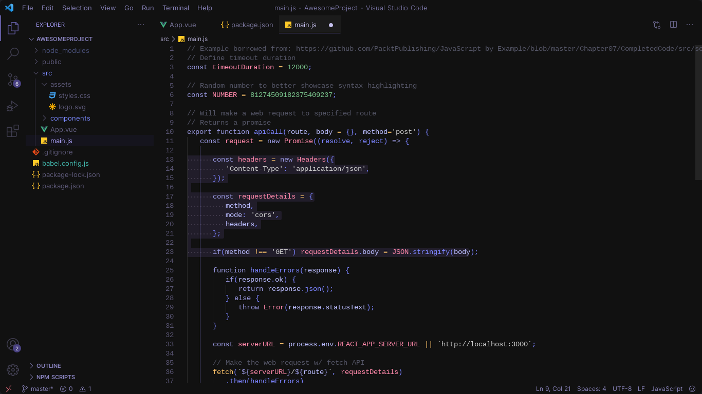

# Rfldllql color theme for [Visual Studio Code](http://code.visualstudio.com)

[](https://github.com/rafaeldellaquila/rfldllql-theme/blob/master/LICENSE)
[](https://marketplace.visualstudio.com/items?itemName=rafaeldellaquila.rfldllql-color-theme)
[](https://marketplace.visualstudio.com/items?itemName=artlaman.chalice-icon-theme)

A charming purple Theme made for me but if you liked download it too

<p align="center">
  
</p>

If you want to use with Braket Pair Colorization, Highlight Matching Tag and others, this is the colors references from the theme:

```scss
$foreground: #7b83ff;
$variables: #bbbdff;
$keywords: #9695db;
$numbers: #78c08a;
$constants: #ff88aa;
$functions: #7c84ff;
$strings: #c9c9c9;
$operators: #f7bf68;
$comments: #545566;
```

Good day and good work.
